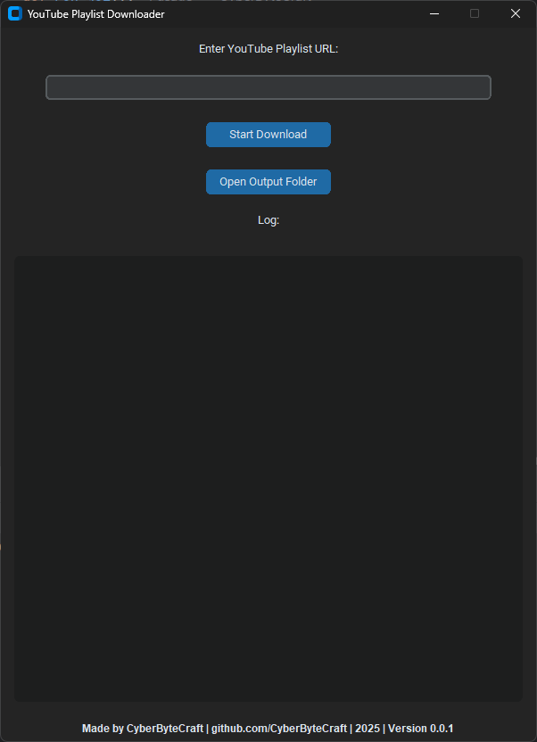

# YouTube Playlist Downloader with GUI

A GUI application built with `customtkinter`, `yt-dlp`, and `pytube` that allows users to download YouTube playlists directly to their local machine. The application offers a user-friendly interface and customizable output options for downloading the best quality video and audio.

## Features

- **Download YouTube Playlists**: Download entire playlists from YouTube in the best available format for both video and audio.
- **Custom Output Directory**: Saves playlists into organized folders with sanitized names.
- **Log Console**: Displays real-time logs for detailed progress and error management.
- **Dark Mode User Interface**: Built with `customtkinter` for a modern and sleek GUI experience.
- **Interactive Buttons**: Open the output folder or visit the project's GitHub page directly through the application.

## Preview



## Requirements

- Python 3.8 or above
- `pytube` for playlist metadata handling
- `yt-dlp` for downloading video content
- `customtkinter` for GUI design

## Installation

1. Clone this repository:
   ```bash
   git clone https://github.com/CyberByteCraft/youtube-playlist-downloader.git
   cd youtube-playlist-downloader
   ```

2. Install the required packages:
   ```bash
   pip install -r requirements.txt
   ```

3. Run the application:
   ```bash
   python main.py
   ```

## Usage

1. Open the app by running the `main.py` file.
2. Paste a valid YouTube playlist URL into the input field.
3. Click the **Start Download** button to begin downloading.
4. View real-time download logs in the designated log area.
5. When the download completes, open the output folder directly with the "Open Output Folder" button.

## Output Structure

Downloaded playlists will be stored in an `output/` directory, organized by sanitized playlist names:


## Key Functions

- `RedirectConsole`: Redirects console output (stdout and stderr) to the log area in the GUI.
- `start_download`: Handles the validation of inputs, playlist sanitization, and the download process in a new thread.
- `progress_hook`: Displays the real-time progress of each video being downloaded.
- `open_save_dir`: Opens the output directory in the default file manager.
- `open_github`: Opens the GitHub page for the project when the footer text is clicked.

## Technologies Used

- **Python**: Core language for developing the application.
- **pytube**: Used to fetch YouTube playlist metadata such as titles.
- **yt-dlp**: A lightweight and highly customizable library to handle downloading.
- **customtkinter**: Provides a modern interface with customizable widgets (dark mode support).

## Contributing

Feel free to fork this project, add features, or fix bugs. Contributions are always welcome. Please make sure to open a Pull Request (PR) and follow the project's coding standards.

## License

This project is licensed under a **Non-Commercial License** See the [LICENSE](NC-License) file for details.

## Credits

- Created by [CyberByteCraft](https://github.com/CyberByteCraft)

## Contact

For inquiries or issues, please open a GitHub issue or reach out [on GitHub](https://github.com/CyberByteCraft).